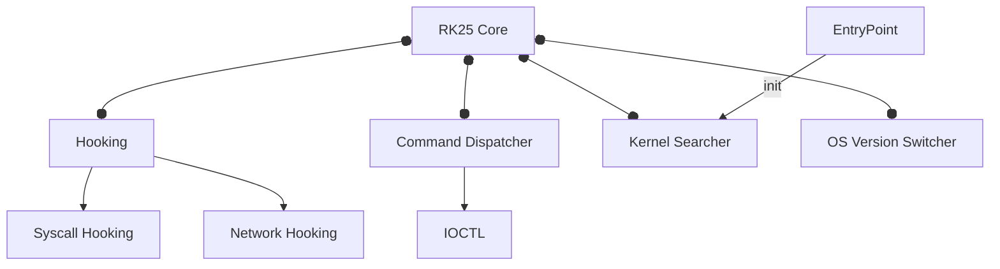

  <h1>
    
    RK25 Rootkit
    
  </h1>
  
Windows kernel-level rootkit adapting to multiple OS versions

  
  
  

---

## Project Overview
RK25 is a kernel-mode rootkit driver designed to dynamically adapt to various Windows versions through syscall table hooking and memory management techniques. Built as a WDM driver, it provides stealth capabilities while maintaining compatibility across major Windows updates.

---

## Architecture

---

## Key Features
  - Automatic OS Version Detection
  - Process hiding
  - Process privilege escalation
  - Network connection hiding
  - ... and something in development :D

---

## Dev Requirements
  - WDK/SDK
  - Visual Studio (driver)
  - Golang (manager)
  - WinDBG
  - OS Windows VM (VMWare etc)

---

## 📄 License
MIT License - see [LICENSE](LICENSE) for details